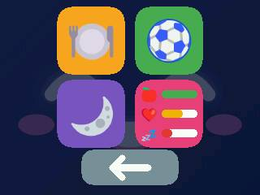
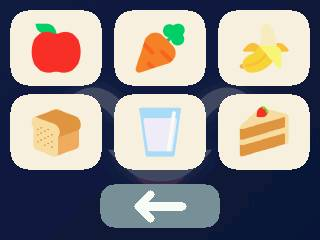
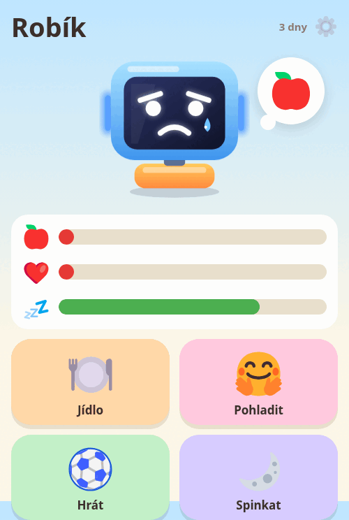
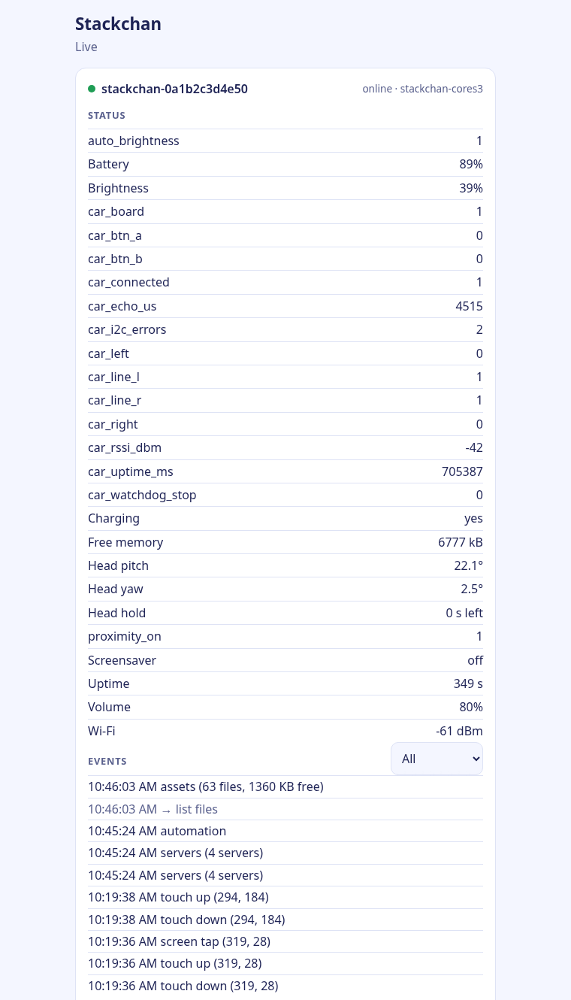
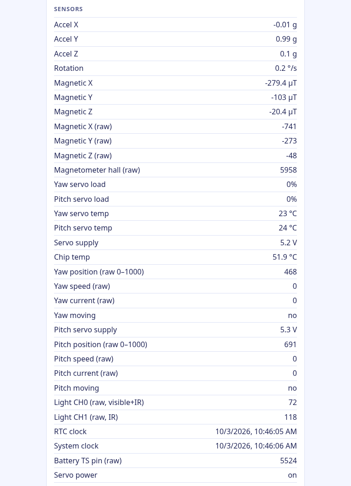
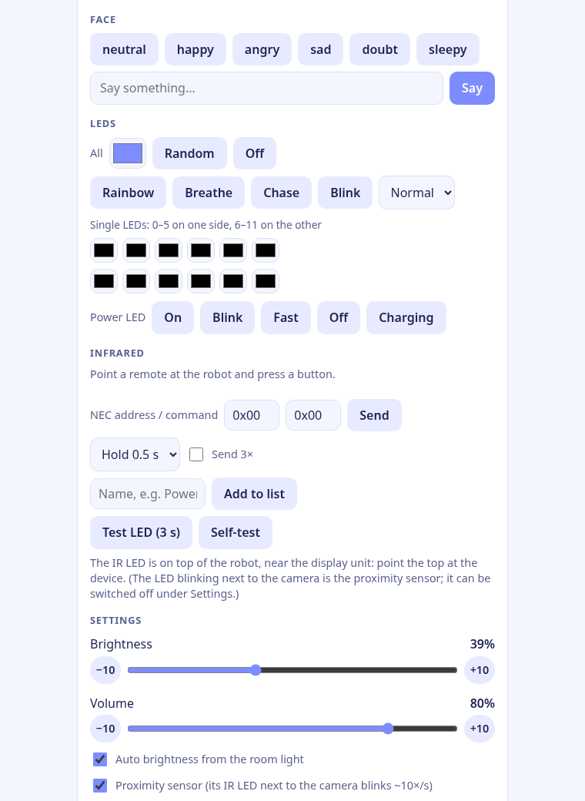
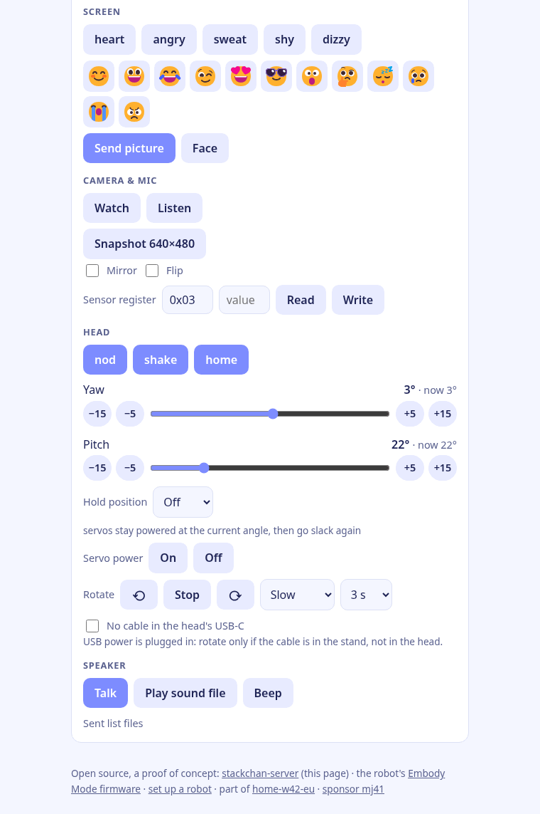
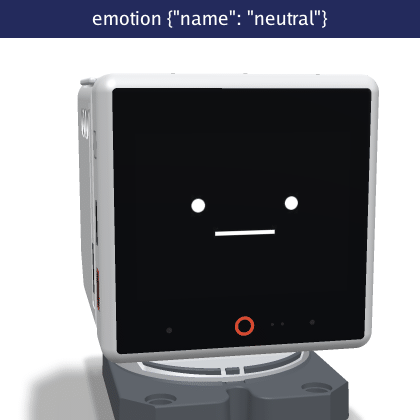
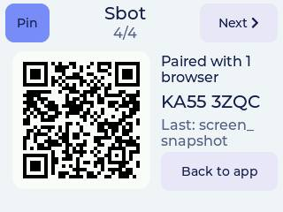

# How Embody Mode works, by example

**The robot is a body. The app lives on a server.**

The firmware on the robot knows no pet, no game and no dashboard. It sends what its
sensors measure, does what it is told, and shows a red LIVE badge while its camera or
microphone streams. Everything else is an app on a server on your own network. Point the
robot at another server and the same robot becomes something else.


```
 Stackchan (Embody Mode)             app server at home                   people
 ───────────────────────             ──────────────────                   ──────
 raw sensors, events, media  ──►     decides and remembers       ◄──►     browser, phone
                             ◄──     commands                             (pairs by QR)
            one WebSocket, opened by the robot
```

Three apps show the idea: a pet for kids, a dashboard with every raw sensor, and a cockpit
that drives a car. All three are proofs of concept, vibe coded (written with AI agents),
tested on one robot at home, and not reviewed by humans.

## 1. The pet: an app for kids

[s-w42-eu-pet](https://github.com/mj41/s-w42-eu-pet) turns the robot into a Tamagotchi.

| The robot's screen | | |
|---|---|---|
|  |  |  |
| hungry: it asks for food | a tap on the screen: the menu | food (or hold an NFC food card to it) |

**What a kid does:** strokes its head, taps its screen, holds a card with a banana on it to
the robot, catches a ball on the screen, presses the colors its LED strips show. On a phone
or tablet, a picture page (no reading needed) shows the same pet:



**What really happens:**

1. **The robot reports raw data**, nothing more: `head_press {z0, z1, z2}` from its touch
   zones, `nfc_tag {uid, text}` when a card comes close, `screen_tap {x, y}`, the
   accelerometer, the light sensor.
2. **The pet app decides.** It knows the card means "banana", that the pet ate a banana a
   minute ago (so it is picky now), that it is nap time, and that the robot is in someone's
   hands (so the head must not move). Its needs, the routine, the parents' PIN and the
   leaderboard live on the server.
3. **The pet app sends commands back:** `sprite` places pictures stored on the robot (the
   food gliding into the mouth), `face`, `say`, `leds`, `look` and `nod` for the head,
   `play` for sounds.

The robot never learns that it is a pet. A new game is a change on the server, not new
firmware.

## 2. The dashboard: every raw sensor, every command

The same robot, switched to [s-w42-eu-raw](https://github.com/mj41/s-w42-eu-raw):
one page with everything the robot has. It is the app to see what the hardware can do,
and the reference for writing a new app.

| Status and events | Sensors |
|---|---|
|  |  |

| Face, LEDs, infrared, settings | Screen, camera, head, speaker |
|---|---|
|  |  |

- **Raw data only.** The robot reports numbers: battery voltages and currents, servo
  positions and temperatures, magnetometer, light, proximity, touch points, NFC memory, IR
  timings. Meaning ("someone picked me up", "the room got dark") is the app's job, so every
  app can decide it its own way.
- **Every command** the robot has is a button: the face, speech bubbles, pictures from the
  phone, LEDs one by one, infrared codes, the head, sounds, files on the robot.



## 3. The cockpit: the robot with other devices

[s-w42-eu-sbot](https://github.com/mj41/s-w42-eu-sbot) shows the robot together with an ELECFREAKS TPBot car
(a micro:bit with [tpbot-ble](https://github.com/mj41/tpbot-ble)), which the robot drives
over its own Bluetooth: the robot's camera, a joystick, the head, lights, and a safety stop
that refuses forward driving when the car's sonar sees an obstacle.


sbot is also the seed of a whole home platform,
[home-w42-eu](https://github.com/mj41/home-w42-eu): an event hub records every reading and
command, and small loops react (the robot looks sad while its car is blocked).

## 4. Switching apps

| | |
|---|---|
|  |  |

- **On the robot:** swipe up, **QR**. The QR screen pairs a phone (scan it, or type the
  8-character code) and switches apps: **Next** shows the next server, **Connect** goes
  there, **Pin** makes it the default.
- **From a server:** a server can offer others to its robots, and a page can move the robot
  (`server_switch`).
- **Without anyone touching it** (optional, off by default): the robot can start Embody Mode
  after a power-on (a checkbox at setup), and a server (or an AI agent through it) can restart
  the robot or open another app.

## Why it is built this way

- **One firmware, many apps.** Flash once; a new app is a new server.
- **Apps in Go on your own machine.** The robot talks to a server you run, on your network;
  the public [chan.w42.eu](https://chan.w42.eu) is optional.
- **Privacy you can see.** Camera and microphone stream only while a paired browser watches
  or listens, and the robot shows LIVE.
- **Safety close to the hardware.** The car stops on its own 500 ms after the last command;
  the robot stops the car when its server connection drops.

Set a robot up: [SETUP.md](https://github.com/mj41/StackChan/blob/embody-mj41/firmware/main/apps/app_embody_mode/SETUP.md).
The screenshots are the robot's own screen (`screen_snapshot`) and the apps' pages, taken
on 2026-10-03 with the camera off; ids and addresses are placeholders.
